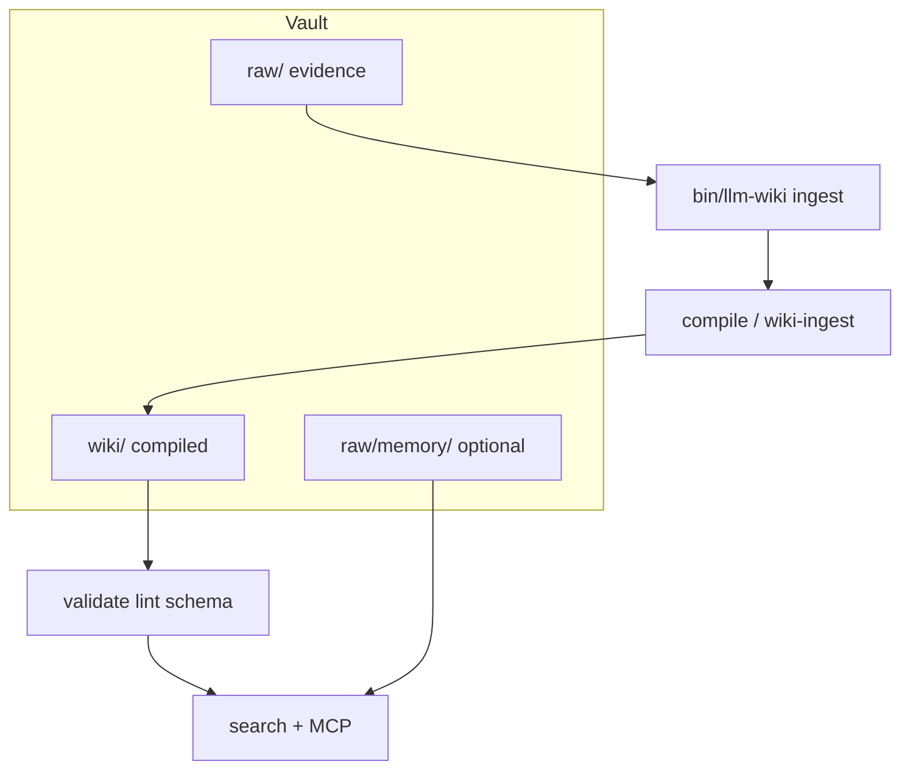

  

  
  &nbsp;
  
  &nbsp;
  

# llm-wiki architecture (overview)

## Two products in one repo

| | **Vault (compiled knowledge)** | **Plugin (compiler + delivery)** |
|---|-----------|-----------------|
| **What** | Your knowledge folder (`llm-wiki/`): immutable `raw/`, curated `wiki/`, `config.json` | This repository: CLI, compile/lint gates, skills, MCP, templates |
| **Where** | Your project (or `--vault` / `LLM_WIKI_VAULT`) | Cloned / marketplace plugin path |

Optional modules (session memory, benchmarks, `apps/web`) share the same plugin but are **not** the core compiler product.

## What ships where

| Surface | Plugin clone / marketplace | pip wheel |
|---------|------------------------------|-----------|
| CLI + MCP modules | Yes | Yes |
| `templates/`, skills, commands | Yes | No (`setup` refuses) |
| Agent desk `apps/web` | Yes (optional) | No |

## Data flow (compiler)

- **Ingest** writes evidence to **`raw/`**; **wiki-ingest** (in chat/skills) curates **`wiki/`**.
- **`raw validate`** skips **`raw/memory/`**; session files are still **searchable** (e.g. `scope=memory`).
- **Benchmarks** (`llm-wiki benchmark …`) exercise retrieval against the vault index; metrics go to **`storage.metrics_db`** (see [`benchmarks/README.md`](../benchmarks/README.md); optional tracked run artifacts under [`docs/memory/benchmarks/runs/`](./memory/benchmarks/runs/README.md)).

## Agent instructions

- **`docs/AGENTS.shared.md`** is the single source for **`AGENTS.md`**, **`CLAUDE.md`**, and Cursor rules — run **`bin/llm-wiki sync-agent-docs`** after edits.

## Further reading

- [`docs/QUICKSTART.md`](./QUICKSTART.md) — tiers and first commands.
- [`skills/references/mcp-and-kg.md`](../skills/references/mcp-and-kg.md) — MCP, search, KG, session memory tools.
- [`docs/THREAT-MODEL.md`](./THREAT-MODEL.md) — trust boundaries and hardening.
- [`ETHOS.md`](../ETHOS.md) — evidence layers.
