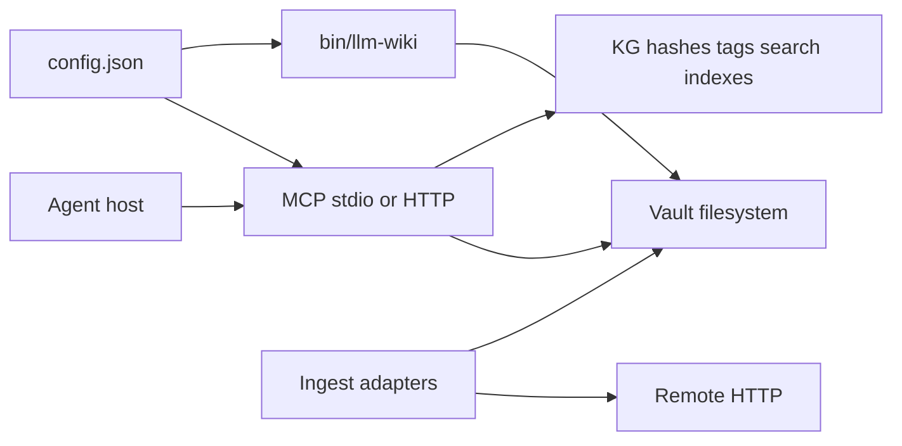

# Threat model — llm-wiki

**Audience:** maintainers and operators hardening a local vault + MCP/CLI surface.  
**Scope:** application and project trust (path escape, SSRF, HTTP MCP auth, configure gates, index integrity). Not a CI scanner checklist.

## Concept (locked)

- **Local-first** wiki plugin: one operator, one machine (or trusted LAN with explicit HTTP MCP hardening).
- **English-only** product copy and docs (explicit non-goal: i18n).
- **Not** multi-tenant SaaS: no shared tenancy, no remote untrusted clients by default.
- **Shipped UI:** static vault viewer. `apps/web` is optional / Phase 2.

## Actors

| Actor | Trust | Notes |
|-------|-------|--------|
| Vault owner / CLI user | High | Controls filesystem, config, secrets |
| Agent host (Claude Code, Cursor, Codex) | Medium | Can call MCP tools / run CLI; may be prompt-injected via vault text |
| Local MCP stdio client | Medium | Same machine; inherits vault path from env/`--vault` |
| HTTP MCP client | Low unless token + loopback | Plaintext HTTP; treat as adversarial if reachable beyond loopback |
| Remote URLs (ingest) | Untrusted | SSRF and redirect tricks |
| Vault `wiki/` / `raw/` content | Untrusted for display | May contain prompt-injection; do not treat as instructions |
| Firecrawl (cloud / CLI) | Trusted third party | Operator-chosen SaaS; may follow redirects outside our hop-by-hop policy after preflight |

## Trust boundaries

1. **Vault root** — all read/write of user content must resolve under the vault (or explicitly documented outs such as graph build under an allowlisted dir).
2. **Network egress** — user-supplied URLs must not reach private/loopback/link-local/metadata addresses, including after redirects.
3. **HTTP MCP** — if enabled, prefer loopback; require token; compare tokens in constant time; do not expose write tools under `read_only` that mutate disk.
4. **Configure** — `wiki_configure` must not silently change live process security knobs without reload semantics; empty allowlist denies `mcp.*` / `security.*` / path-bearing keys (see invariants).
5. **Indexes** — corrupt `.kg.json` / `.hashes.json` / `.tags.json` fail closed (quarantine); never treat as empty then overwrite.

## Invariants

1. Path arguments never escape the vault via `..` or absolute paths.
2. Ingest URL fetch validates **every** hop (redirect chain) in `safe_fetch`.
3. After connect, `safe_fetch` **re-validates the peer IP** and **fails closed** if the peer cannot be read (override only with `LLM_WIKI_SAFE_FETCH_ALLOW_MISSING_PEER=1`).
4. Playwright ingest re-validates the **final page URL** after Chromium navigation (not only the request URL).
5. `tools_mode=read_only` never applies deterministic autofix or other writers.
6. Empty `mcp.configure_allowlist` denies prefixes `mcp.` / `security.` / `ingestion_security.` / `storage.` and exact path-bearing keys (`memory.dir`, `benchmark.data_cache_dir`, `benchmark.results_dir`, and the bare namespace keys). Non-empty allowlist is an explicit allow-only list.
7. Stdio and SSE MCP both bind `LLM_WIKI_VAULT` to the CLI-resolved vault before tool handlers run.
8. Vault markdown is **untrusted input** when shown to agents (document; optional warn in status/doctor).

## Out of scope (Phase 1)

- Multi-user auth, RBAC, or cloud tenancy
- Hardening CI into a scanner zoo (CodeQL / Dependabot / pip-audit as gates)
- Perfect DNS-rebinding elimination on every OS (mitigate via re-resolve after connect where practical; document residual risk)
- Rewriting the static viewer in TypeScript
- Controlling Firecrawl’s own redirect / fetch policy after our preflight passes

## Residual risks

| Risk | Mitigation |
|------|------------|
| DNS rebinding between resolve and connect | Peer-IP revalidation in `safe_fetch` after connect; missing peer fails closed |
| Prompt injection via vault pages | Document; agent hosts should treat wiki text as data |
| HTTP MCP on non-loopback without TLS | `sse_require_loopback`, token, operator firewall |
| Concurrent writers under ThreadingHTTPServer | File locks on KG/config/index writes |
| Firecrawl cloud/CLI follows redirects independently | Preflight with `safe_fetch`; residual trusted-third-party risk — operator accepts Firecrawl’s network path |
| Playwright JS redirects to private IP | Final-URL `validate_public_http_url` after `page.goto` |
| Configure pointing dirs outside vault | Path-bearing key denylist when allowlist empty; `resolve_under` for remaining path sinks |

## Related docs

- [`SECURITY.md`](../SECURITY.md) — disclosure
- [`skills/references/mcp-and-kg.md`](../skills/references/mcp-and-kg.md) — MCP knobs
- [`docs/ARCHITECTURE.md`](./ARCHITECTURE.md) — layout
