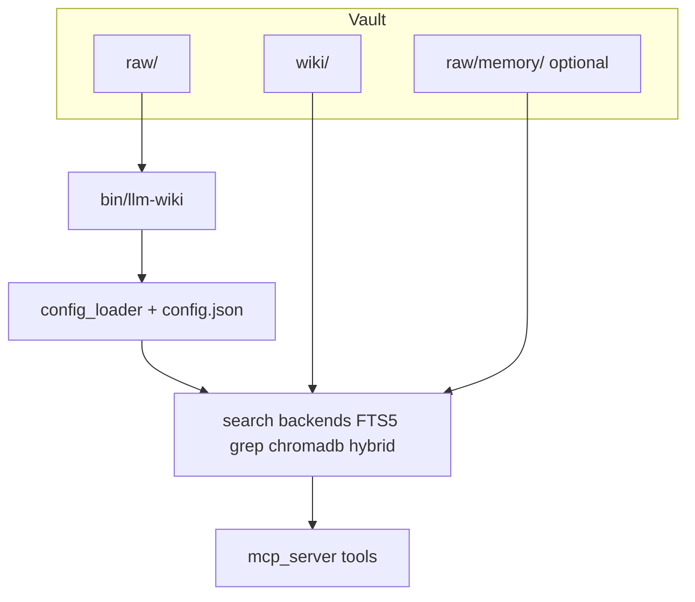

# llm-wiki architecture (overview)

## Two products in one repo

| | **Vault** | **Plugin repo** |
|---|-----------|-----------------|
| **What** | Your knowledge folder (`llm-wiki/` by default): `wiki/`, `raw/`, `config.json` | This repository: CLI, skills, commands, MCP, templates |
| **Where** | Your project (or anywhere you point `--vault` / `LLM_WIKI_VAULT`) | Cloned / installed plugin path |

Session memory (**`memory.enabled`**, **`raw/memory/`**) is an **optional module of the same plugin** — not a separate marketplace plugin. It shares config, CLI, and MCP with wiki tooling.

## Data flow (simplified)

- **Ingest** writes evidence to **`raw/`**; **wiki-ingest** (in chat/skills) curates **`wiki/`**.
- **`raw validate`** skips **`raw/memory/`**; session files are still **searchable** (e.g. `scope=memory`).
- **Benchmarks** (`llm-wiki benchmark …`) exercise retrieval against the vault index; metrics go to **`storage.metrics_db`** (see [`benchmarks/README.md`](../benchmarks/README.md) and [`docs/memory/benchmarks/PLAN.md`](./memory/benchmarks/PLAN.md)).

## Agent instructions

- **`docs/AGENTS.shared.md`** is the single source for **`AGENTS.md`**, **`CLAUDE.md`**, and Cursor rules — run **`bin/llm-wiki sync-agent-docs`** after edits.

## Further reading

- [`docs/QUICKSTART.md`](./QUICKSTART.md) — tiers and first commands.
- [`skills/references/mcp-and-kg.md`](../skills/references/mcp-and-kg.md) — MCP, search, KG, session memory tools.
- [`ETHOS.md`](../ETHOS.md) — evidence layers.
